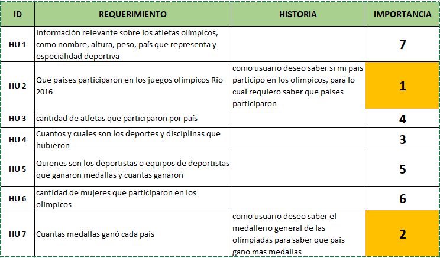
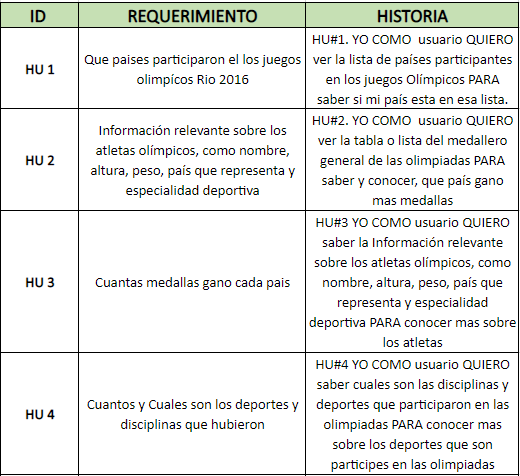

# Data Lovers : OlimpicS Lovers

## Índice

* Introduccion
* 1. Definición del Proyecto
* 2. Historias de Usuario
*
## Introduccion

## 1. Definición del Proyecto

En primer lugar, inicie con la revisión de las datas para luego tomar una decision de con cual data trabajar, por lo cual Tras revisar los seis(6) set de datos escogí trabajar con la Data de:
**Los Juegos Olímpicos de Rio de janeiro**.

El paso a seguir fue la investigación de usuarios potenciales, para los cual se definio:
Los principales Usuarios son:
* Deportistas.
* Amantes del deporte.
* Toda persona con gusto en los deportes y que tenga interés en conocer sobre desempeños y logros   obtenidos por Deportistas Profesionales.

Los objetivos de los usuarios con relacion al producto se basan en el deseo y necesidad de tener informacion del tema de su gusto en este caso los Juegos olimpicos de Rio 2016, a su disposicion y de una manera mas clara y directa.

Para dar inicio al desarrollo del proyecto importe la data e identifique la informacion que contenia para luego decidir que informacion podria usar para resolver los requerimientos o necesidades que tienen los usuarios potenciales.

Con respecto a las necesidades del usario se tomo encuenta la Investigacion con las personas interesadas en los juegos olimpicos de Rios de Janeiro 2016, para hacer el desarrollo de las historias de usuario. Tras lo cual inicie con el desarrollo del prototipo de baja fidelidad hecho a mano en papel y lapiz:

Al tener el prototipo de baja fidelidad terminado y recibir los feedback de compañeros y coach, procedi a elaborar el prototipo de alta fidelidad, en primer lugar para celulares:

## 2. Historias de Usuario

 Para la elaboracion de historias de usuario se tuvo en cuenta la investigacion con las personas interesadas en los juegos olimpicos de Rios de Janeiro 2016, teneindo en cuenta los datos mas relevantes que podrian o seran segun la investigacion mas solicitados por los usuarios; para lo cual en primer lugar se clasifico dandole un puntaje resltando el considerado mas importante o relevante al menos importante:

  

  Y tras recibir el feedback, se determino las principales cuatro (4) historias de usuario que se trabajarian en el desarrollo del proyecto:

  

El desarrollo de estas historias de usuario en el marco del proyecto se basan en generar la satisfaccion de los requerimientos y necesidades que se genaran tras querer adquirir la informacion de un determinado tema de interes, en este caso Los juegos Olimpicos de Rio de Janeiro 2016, cuya informacion estaria disponible de manera accequible en el momento en que se requiera y sera de facil acceso.

**Historia de Usuario #1**
*YO COMO usuario QUIERO ver la lista de países participantes en los juegos Olímpicos PARA saber si mi país esta en esa lista.*

Criterios de Aceptación:
*

**Uso de HTML semántico**

