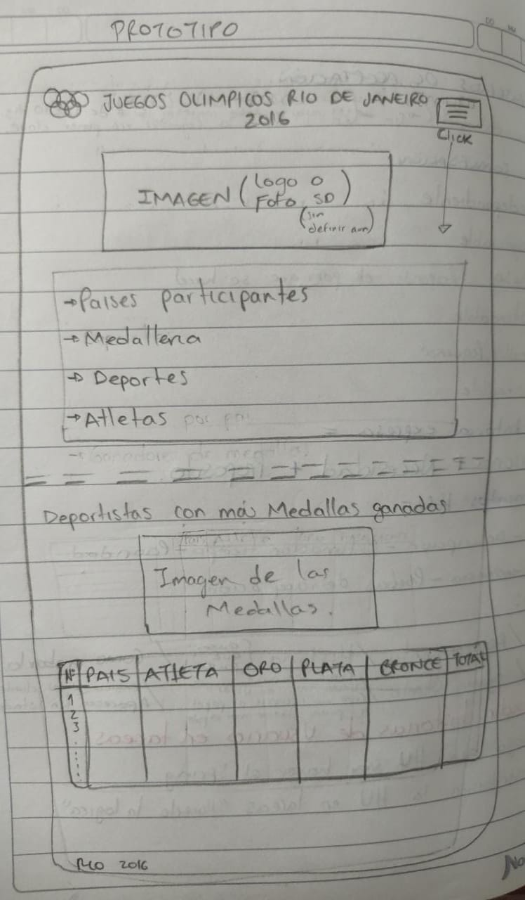
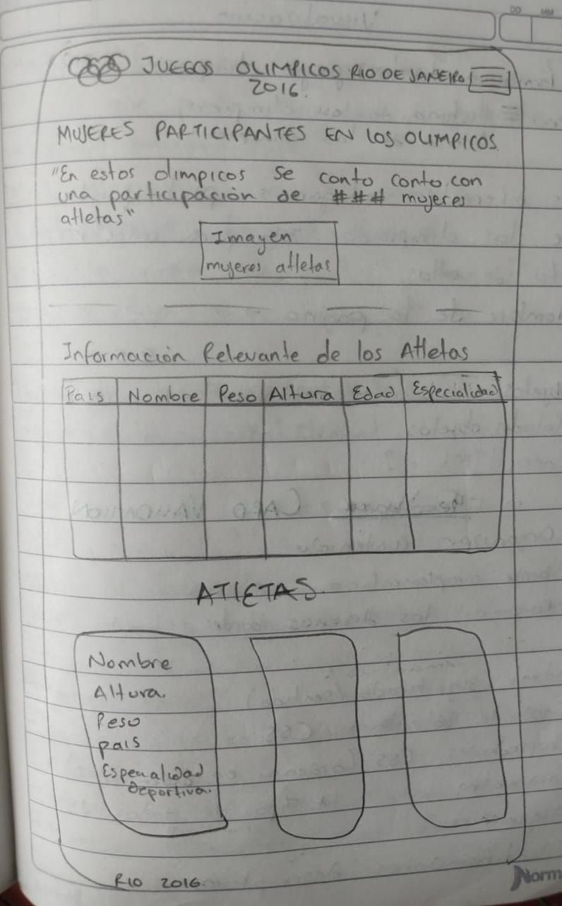
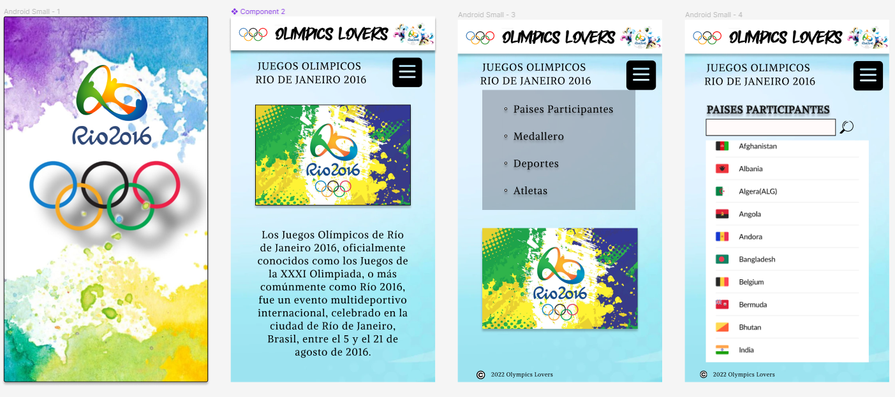

# Data Lovers

## Índice

* ¿Quiénes son los principales usuarios de producto?
* ¿Cuáles son los objetivos de estos usuarios en relación con el producto?
* ¿Cuáles son los datos más relevantes que quieren ver en la interfaz y por qué?
* ¿Cuándo utilizan o utilizarían el producto?
* Historias de usuario

***

## 1. Definición del Producto

En primer lugar, inicie con la revisión de las datas para luego tomar una decision de con cual data trabajar, por lo cual Tras revisar los seis(6) set de datos escogí trabajar con la Data de:
Los Juegos Olímpicos de Rio de janeiro.

El paso a seguir fue la investigación de usuarios potenciales, para los cual se definio:
Usuarios:
* Deportistas.
* Amantes del deporte.
* Toda persona con gusto en los deportes y que tenga interés en conocer sobre desempeños y logros   obtenidos por Deportistas Profesionales.

Para dar inicio al desarrollo del proyecto importe la data e identifique la informacion que contenia para luego decidir que informacion podria usar para resolver los requerimientos o necesidades que tienen los usuarios potenciales.

Con respecto a las necesidades del usario se tom encuenta la Investigacion con las personas interesadas en los juegos olimpicos de Rios de Janeiro 2016, para hacer el desarrollo de las historias de usuario. Tras lo cual inicie con el desarrollo del prototipo de baja fidelidad hecho a mano en papel y lapiz:

Al tener el prototipo de baja fidelidad terminado y recibir los feedback de compañeros y coach, procedi a elaborar el prototipo de alta fidelidad, en primer lugar para celulares:

## 2. Resumen del proyecto

**Uso de HTML semántico**

